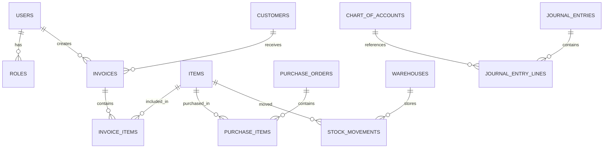

# উচ্চ-লেভেল ডাটাবেস স্কিমা (ড্রাফট)

এই ডকটি Phase-1 কোর মডিউলগুলোর জন্য হাই-লেভেল টেবিল ও সম্পর্ক দেয়। এটি বিস্তারিত ERD ও মাইগ্রেশন-ফাইলের ভিত্তি।

## নোট
- প্রতিটি টেবিলে `id`, `created_at`, `updated_at`, `deleted_at` (soft deletes) রাখুন যেখানে প্রযোজ্য।
- Foreign key গুলো অবশ্যই index করা হবে।

---

## মূল টেবিল ও মূল ফিল্ড (সংক্ষিপ্ত)

### users
- id, name, email (unique), password_hash, is_active, last_login

### roles / permissions
- roles: id, name, guard_name
- permissions: id, name, guard_name
- model_has_roles, model_has_permissions (pivot)

### customers
- id, name, contact_person, email, phone, billing_address, shipping_address, tax_id

### suppliers
- id, name, contact_person, email, phone, address

### items
- id, sku, name, description, uom, cost_price, sale_price, category_id

### item_categories
- id, name, parent_id

### warehouses
- id, name, location, code

### stock_movements
- id, item_id, warehouse_id, type (IN/OUT/ADJ/TRANSFER), qty, reference_type, reference_id, batch_no, serial_no, transaction_date

### inventory_balances
- id, item_id, warehouse_id, qty_on_hand, qty_allocated, qty_available

### purchase_orders / purchase_items
- purchase_orders: id, supplier_id, ref_no, status, order_date, expected_date, total_amount
- purchase_items: id, purchase_order_id, item_id, qty, unit_price, line_total

### goods_receipt_notes (grns)
- id, purchase_order_id (nullable), received_by, received_date, total_amount

### sales_orders / invoices / invoice_items
- sales_orders: id, customer_id, ref_no, status, order_date, total_amount
- invoices: id, sales_order_id (nullable), customer_id, invoice_no, status, invoice_date, due_date, total_amount
- invoice_items: id, invoice_id, item_id, qty, unit_price, line_total

### payments
- id, invoice_id (nullable), payment_date, amount, method, reference_no, account_id

### chart_of_accounts / ledger_accounts / journal_entries
- chart_of_accounts: id, code, name, type (Asset/Liability/Equity/Revenue/Expense), parent_id
- journal_entries: id, date, reference, description
- journal_entry_lines: id, journal_entry_id, account_id, debit, credit, description

### employees / attendances / payslips
- employees: id, user_id, employee_code, hire_date, department_id, designation
- attendances: id, employee_id, date, check_in, check_out, source
- payslips: id, employee_id, period_start, period_end, gross_pay, net_pay

### audit_logs
- id, user_id (nullable), action, model_type, model_id, changes (JSON), ip_address, created_at

---

## উদাহরণ ERD (Mermaid erDiagram)

---

## পরবর্তী (টেকনিক্যাল)
- প্রতিটি টেবিলের জন্য Laravel মাইগ্রেশন ও Eloquent মডেল তৈরি করুন।
- Index ও FK কনফিগারেশন: প্রাইমারি ও রিলেশনাল ফিল্ড-এ index/unique সংযোজন নিশ্চিত করুন।
- ডাটা মাইগ্রেশন স্ট্র্যাটেজি: CSV mapping টেবিল, dry-run import, validation reports।

